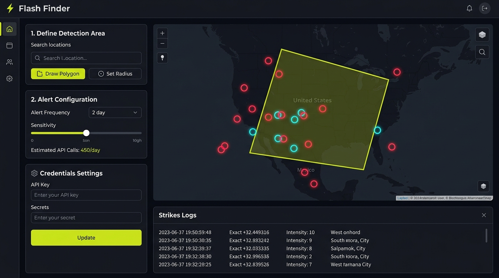

# ⚡ Flash Finder

Flash Finder is an interactive, real-time lightning monitoring web application. It allows users to define custom threat regions (circular or multi-vertex polygons) on a dynamic Leaflet map, visually tracks lightning strike fronts with real-time age-fading rendering, and triggers rich Discord alert embeds when a strike breaches the defined boundaries.



---

## ✨ Features

*   **Dynamic Geofencing**: Draw circular regions (click-and-drag radius) or custom multi-vertex polygons (multi-click drawing tools) on a dark CartoDB Leaflet map.
*   **Real-Time Strike Tracking**: Direct backend integration with the XWeather API. Updates are polled every 5 minutes.
*   **Dynamic Age Fading**: Map strike markers dynamically fade as they age:
    *   🔴 **0 - 15 minutes**: Vibrant danger-red (Active storm front).
    *   🟠 **15 - 60 minutes**: Medium-faded orange.
    *   ⚪ **60+ minutes**: Low-opacity gray (Historical storm activity).
*   **Smart Buffering & Target Alerts**: Plots *all* lightning strikes detected within the query radius (marked as cyan/blue buffer dots) so you can track approaching storms, but *selectively alerts* on Discord only when strikes hit inside your exact defined threat area.
*   **API Usage Estimator**: Automatically calculates the number of API calls that will be made and the percentage of your monthly XWeather free-tier quota (1,500 free calls/month) before starting a monitoring run.
*   **In-App Settings**: Configure your credentials dynamically in the sidebar. Credentials are saved locally or persisted inside container volumes.
*   **Multi-Platform Containerization**: Out-of-the-box support for Podman and Docker.

---

## 🛠️ Technology Stack

*   **Frontend**: Vue 3, Vite, Leaflet.js (Custom SVG vector rendering for strikes and coordinates, bypassing image loader restrictions).
*   **Backend**: FastAPI, Uvicorn, HTTPX (Custom geo-containment algorithms: Ray-Casting for polygons and Haversine formula for circles).
*   **CI/CD**: GitHub Actions (Built for multi-platform architectures: `linux/amd64` and `linux/arm64`).

---

## 🚀 Getting Started

### Option A: Run with Podman/Docker (Recommended)

Flash Finder is fully containerized. To persist settings across container updates, mount a volume to `/app/data`.

1.  **Build the Container Image**:
    ```bash
    podman build -t flash-finder -f Containerfile .
    ```

2.  **Run the Container**:
    ```bash
    mkdir -p ./flash-finder-data
    podman run -d -p 8000:8000 -v ./flash-finder-data:/app/data:Z --name flash-finder flash-finder
    ```
    *(Note: Use `:Z` flag on SELinux/macOS environments to enable shared folder permissions.)*

3.  Open **`http://localhost:8000`** and configure your keys in the **Credentials Settings** panel.

---

### Option B: Run Locally (Bare-Metal)

1.  **Install dependencies and build the Vue frontend**:
    ```bash
    cd frontend
    npm install
    npm run build
    cd ..
    ```

2.  **Run the FastAPI backend** (automatically serves the built client files):
    ```bash
    uv run python main.py
    ```

3.  Open **`http://localhost:8000`** in your browser.

---

## ⚙️ Configuration Setup

You can configure credentials directly on the UI or create a `.env` file in the root workspace folder:

```env
XWEATHER_API_KEY=YOUR_CLIENT_ID_YOUR_CLIENT_SECRET
DISCORD_WEBHOOK=https://discord.com/api/webhooks/YOUR_WEBHOOK_URL
```

*   **XWeather API Key**: Combine your `Client ID` and `Client Secret` with an underscore, e.g., `clientid_clientsecret`.
*   **Discord Webhook**: Copy your webhook URL from the **Channel Settings > Integrations** page on your Discord server.
